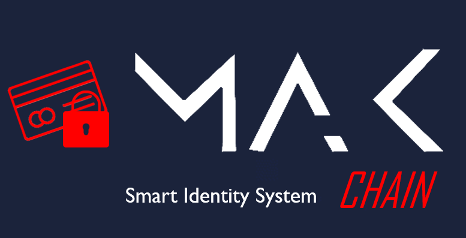
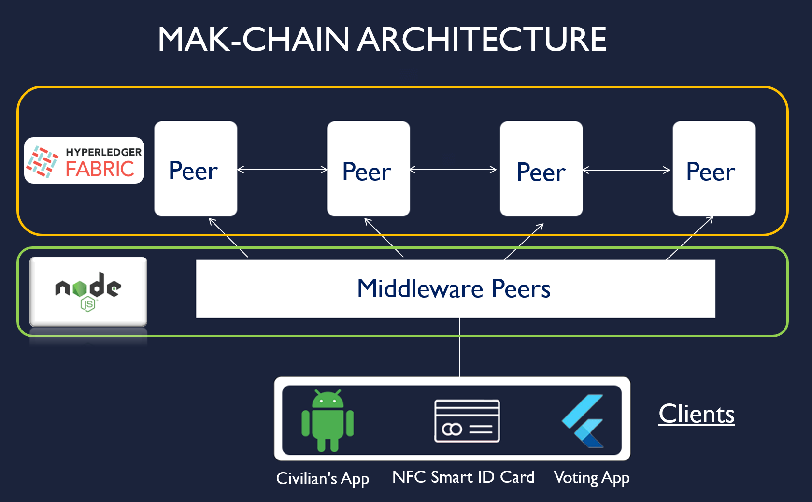
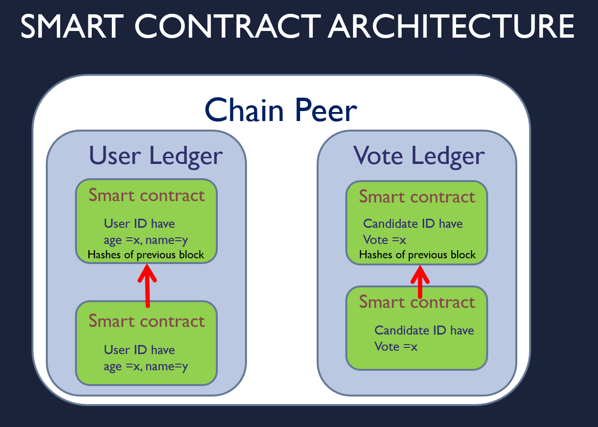
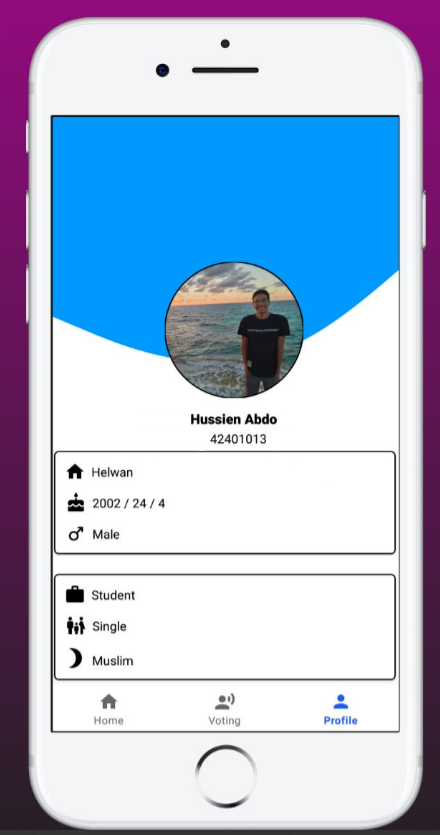
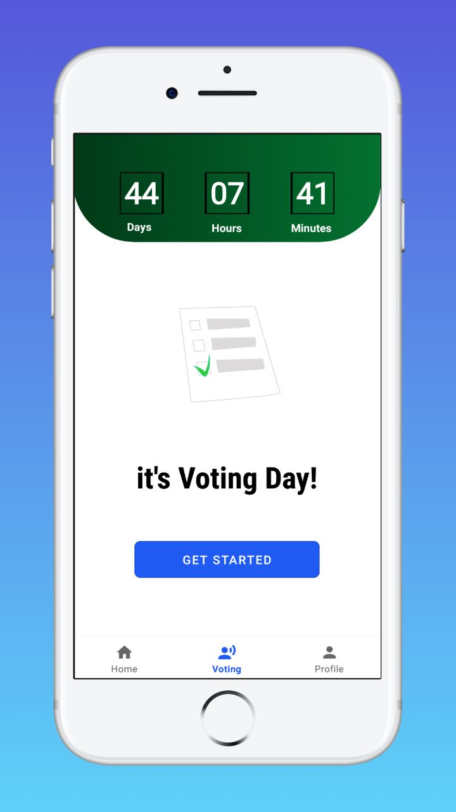
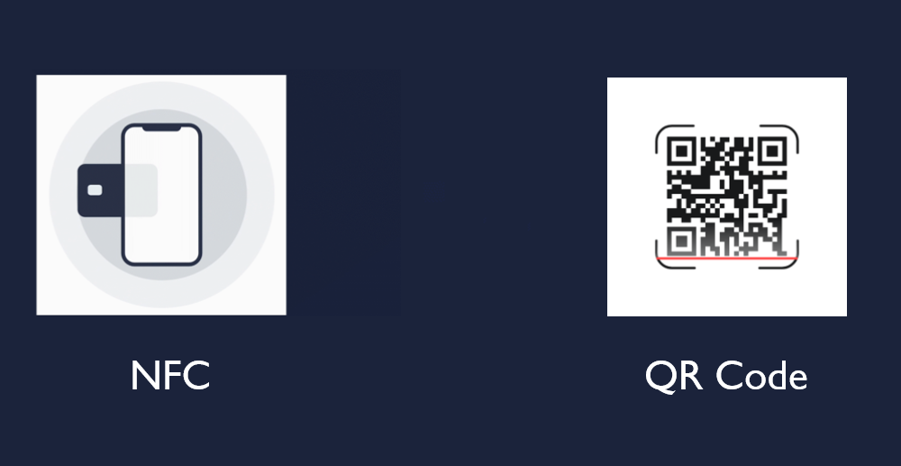
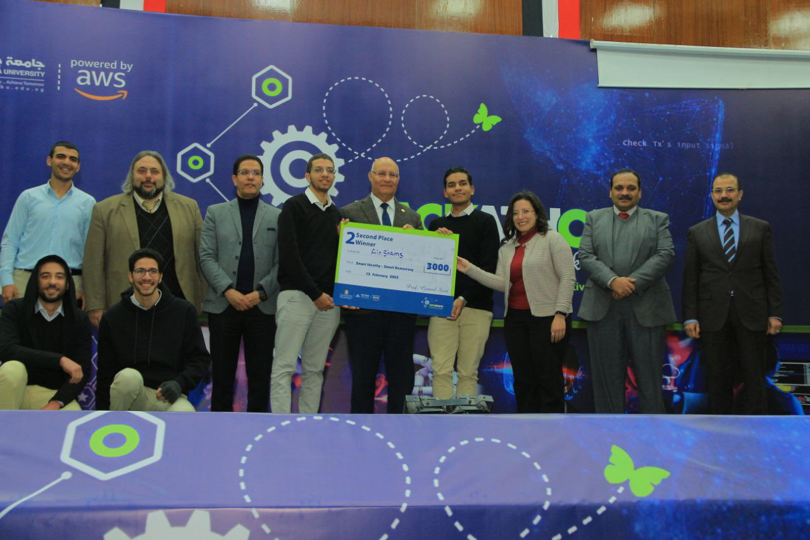

# MAK Chain

 </em>
 
<em>MAK Chain Smart Identity and Governance System </em>

 

An infrastructure for sensitive governmental services and identifying civilians using NFTs and blockchain technology.

## Overview

The `MAK-Chain` is a blockchain-based solution for managing identities and governance processes. The system stores identities as smart contracts on the blockchain, providing a secure and tamper-proof way of managing personal information. The system also includes two mobile apps, one for civilians to interact with available services, and another for government personnel.

## Architecture

 </em>
 
<em>MAK Chain Architecture. </em>

 

The system consists of the following components:

- Blockchain network: the core of the system, where all the smart contracts are stored and transactions are processed. Ethereum is the preferred blockchain network due to its ability to execute smart contracts.
- Smart contracts: the identity information of each individual is stored in a smart contract on the blockchain, providing a secure and tamper-proof way of managing personal information.
- Identity verification system: this system is responsible for verifying the identity of each individual before creating a smart contract for them. This is necessary to prevent fraudulent identities from being created on the system.

 </em>
 
<em>Smart Contract Architecture. </em>

 

- QR code: each smart contract is associated with a QR code, which is used to verify the identity of the individual. The QR code is generated using the smart contract's address and a private key.
- NFC ID card: each smart contract is associated with an NFC ID card, which is used to verify the identity of the individual. The NFC ID card is generated using the smart contract's address and a private key.
- Mobile app for civilians: this app allows civilians to interact with available services, such as applying for government services or registering for voting and verifying thier identities at checkpoints.
- Mobile app for voting: this app is used for participating in votings. It verifies the identity of the user through the blockchain-based smart contract and allows the user to cast their vote.

## Features

The Smart Identity and Governance System has the following features:

- Identity verification: before creating a smart contract for an individual, their identity is verified through a rigorous verification process. This ensures that only legitimate identities are added to the system.
- Tamper-proof identity storage: each individual's identity information is stored as a smart contract on the blockchain, providing a tamper-proof and secure way of storing personal information.
- Secure transactions: all transactions on the system are processed through the blockchain network, providing a secure and transparent way of processing transactions.
- Mobile app for civilians: this app allows civilians to interact with available services, such as applying for government services or registering for voting. The app verifies the identity of the user through the blockchain-based smart contract.
- Mobile app for voting: this app is used for participating in votings. It verifies the identity of the user through the blockchain-based smart contract and allows the user to cast their vote.

## Mobile Applications

The current architecture included 2 main applications to demonstrate the high reliability of such infrastructure:

##### Identity App

- Uses the NFC capabilities of the smart phone to allow its holder to authorize his identity when needed, without the need for any paperwork or ID cards
- Works by scanning the NFC ID card and verifying the identity of the holder through the blockchain-based smart contract
- Works contactlessly which makes it ideal for situations like the recent COVID-19 pandemic
- Can be used at governmental agencies, checkpoints and airports to verify the identity of the holder in a secure and tamper-proof manner
- The QR code is generated using the smart contract's address and a private key to be used in the verification process
- The private key is generated for each smart contract and is used to generate the QR code and NFC ID card

##### Voting App

- Relies on the identity of the user through the blockchain-based smart contract and allows the user to cast their vote in a secure and tamper-proof manner.
- Can be used in any voting process to eliminate any fraud or tampering with the results

## Benefits

 </em>
 

The Smart Identity and Governance System offers the following benefits:

- No paper-based records: the system stores identities as smart contracts on the blockchain, eliminating the need for paper-based records.
- Elimination of fraud: the system uses a rigorous identity verification process to ensure that only legitimate identities are added to the system.
- No need for physical visits: the mobile apps allow civilians to interact with available services, eliminating the need for physical visits to government offices.
- Eradication of human error: the use of smart contracts and the blockchain network eliminates the possibility of human error.
- Increased security: the use of smart contracts and the blockchain network provides a secure and tamper-proof way of storing and processing personal information.
- Transparency: all transactions on the system are processed through the blockchain network, providing a transparent way of processing transactions.
- Efficiency: the use of mobile apps allows for efficient interaction with the system, reducing the need for physical visits to government offices.
- Accessibility: the mobile apps make the system accessible to a wider audience, including those in remote areas.

## Contributors

- [@Mohamed Samy](https://github.com/Mohamed-Samy26)
- [@Yousef Elkammar](https://github.com/RedBiscuits)
- [@KareemHussen](https://github.com/KareemHussen)
- [@Abdelrahman Mohamed](https://github.com/abdelrhmanmo)
- [@Ahmed Medhat](https://github.com/Medhat74)

## Awards

 </em>
 
<em>Award. </em>

 

- 2nd place in the <em>Smart Identity and Democracy Track <em> category at the <em> Smart Government Hackathon 2023 <em> organized by the <em> AWS and Benha university <em> in <em>Egypt<em>.

## Conclusion

`MAK Chain` is a blockchain-based solution for managing identities and governance processes. The system stores identities as smart contracts on the blockchain, providing a secure and tamper-proof way of managing personal information. The system also includes two mobile apps, one for civilians to interact with available services, and another for participating in votings. The system offers increased security, transparency, efficiency, and accessibility, making it a valuable tool for managing identities and governance processes.
